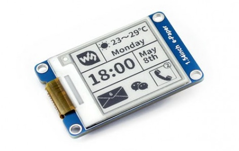
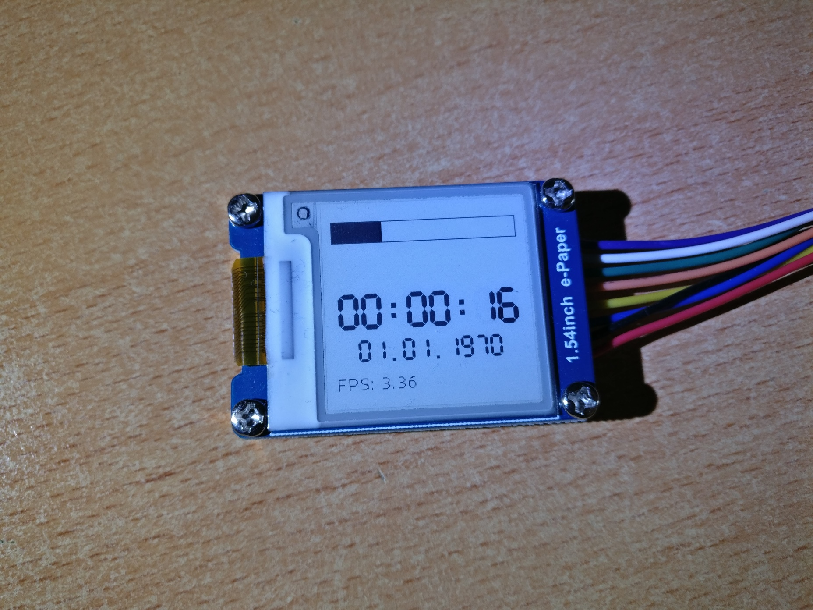
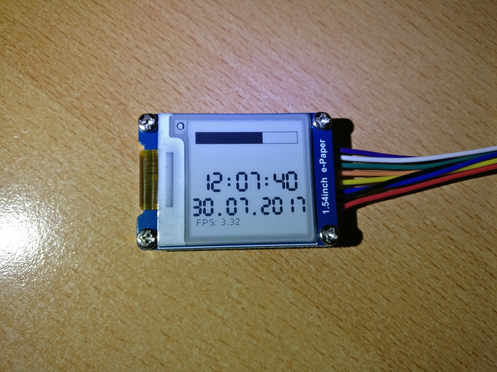
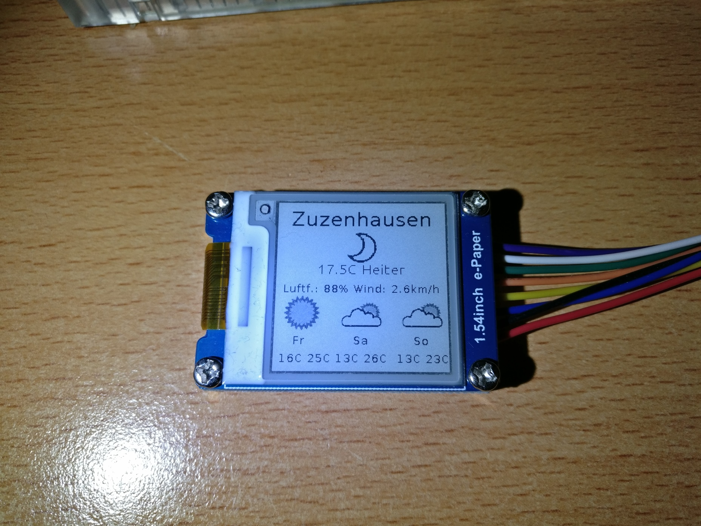
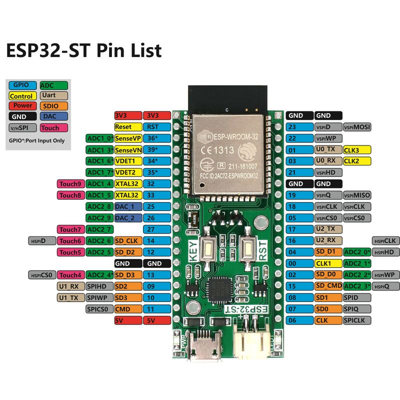

### ePaper library for ESP32 using the Arduino Framework

---

#### Features

* Support for **GDEH029A1** / **SSD1608** based ePaper modules in 4-wire SPI mode. 
* **emulated** 4-bit gray scale mode
* **SPI displays oriented SPI driver library** based on *spi-master* driver
* **4-bit Grayscale mode** or **1-bit b/w mode** can be selected during runtime
* **Demo application** included which demonstrates most of the library features

* **Graphics drawing functions**:
  * **EPD_drawPixel**  Draw pixel at given x,y coordinates
  * **EPD_drawLine**  Draw line between two points
  * **EPD_drawFastVLine**, **EPD_drawFastHLine**  Draw vertical or horizontal line of given lenght
  * **EPD_drawLineByAngle**  Draw line on screen from (x,y) point at given angle
  * **EPD_drawRect**, **EPD_fillRect**  Draw rectangle on screen or fill given rectangular screen region with color
  * **EPD_drawRoundRect**, **EPD_fillRoundRect**  Draw rectangle on screen or fill given rectangular screen region with color with rounded corners
  * **EPD_drawCircle**, **EPD_fillCircle**  Draw or fill circle on screen
  * **EPD_drawEllipse**, **EPD_fillEllipse**  Draw or fill ellipse on screen
  * **EPD_drawTriangel**, **EPD_fillTriangle**  Draw or fill triangle on screen
  * **EPD_drawArc**  Draw circle arc on screen, from ~ to given angles, with given thickness. Can be outlined with different color
  * **EPD_drawPolygon**  Draw poligon on screen with given number of sides (3~60). Can be outlined with different color and rotated by given angle.
* **Fonts**:
  * **fixed** width and proportional fonts are supported; 8 fonts embeded
  * unlimited number of **fonts from file**
  * **7-segment vector font** with variable width/height is included (only numbers and few characters)
  * Proportional fonts can be used in fixed width mode.
  * Related functions:
    * **EPD_setFont**  Set current font from one of embeded fonts or font file
    * **EPD_getfontsize**  Returns current font height & width in pixels.
    * **EPD_getfontheight**  Returns current font height in pixels.
    * **set_7seg_font_atrib**  Set atributes for 7 segment vector font
    * **getFontCharacters**  Get all font's characters to buffer
* **String write function**:
  * **EPD_print**  Write text to display.
    * Strings can be printed at **any angle**. Rotation of the displayed text depends on *font_ratate* variable (0~360)
    * if *font_transparent* variable is set to 1, no background pixels will be printed
    * If the text does not fit the screen/window width it will be clipped ( if *text_wrap=0* ), or continued on next line ( if *text_wrap=1* )
    * Two special characters are allowed in strings: *\r* CR (0x0D), clears the display to EOL, *\n* LF (ox0A), continues to the new line, x=0
    * Special values can be entered for X position:
      * *CENTER*  centers the text
      * *RIGHT*   right justifies the text horizontaly
      * *LASTX*   continues from last X position; offset can be used: *LASTX+n*
    * Special values can be entered for Y:
      * *CENTER*  centers the text verticaly
      * *BOTTOM*  bottom justifies the text
      * *LASTY*   continues from last Y position; offset can be used: *LASTY+n*
  * **EPD_getStringWidth** Returns the string width in pixels based on current font characteristics. Useful for positioning strings on the screen.
  * **EPD_clearStringRect** Fills the rectangle occupied by string with current background color
* **Images**:
  * **EPD_jpg_image**  Decodes and displays JPG images
    * Limits:
      * Baseline only. Progressive and Lossless JPEG format are not supported.
      * Image size: Up to 65520 x 65520 pixels
      * Color space: YCbCr three components only. Gray scale image is not supported.
      * Sampling factor: 4:4:4, 4:2:2 or 4:2:0.
    * Can display an image from a **memory buffer**
    * Image can be **scaled** by factor 0 ~ 3  (1/1, 1/2, 1/4 or 1/8)
    * Image is displayed from X,Y position on screen/window:
      * X: image left position; constants CENTER & RIGHT can be used; *negative* value is accepted
      * Y: image top position;  constants CENTER & BOTTOM can be used; *negative* value is accepted
    * Image is converted to **4-bit Gray Scale mode**
* **Other display functions**:
  * **EPD_fillScreen**  Fill the whole screen with black, white or gray scale

* **Global variables**
  * **orientation**  current screen orientation
  * **font_ratate**  current font rotate angle (0~395)
  * **font_transparent**  if not 0 draw fonts transparent
  * **font_forceFixed**  if not zero force drawing proportional fonts with fixed width
  * **text_wrap**  if not 0 wrap long text to the new line, else clip
  * **_fg**  current foreground color for fonts
  * **_bg**  current background for non transparent fonts
  * **_angleOffset**  angle offset for arc, polygon and line by angle functions
  * **image_debug**  print debug messages during image decode if set to 1
  * **cfont**  Currently used font structure
  * **EPD_X**  X position of the next character after EPD_print() function
  * **EPD_Y**  Y position of the next character after EPD_print() function
  * **_gs**  use 4-bit Gray scale if set to 1
  * **_width** screen width (larger dimension) in pixels
  * **_height** screen height (smaller dimension) in pixels

---

Full functions **syntax and descriptions** can be found in *EPD.h* and *EPDspi.h* files.

Full **demo application**, well documented, is included, please **analyze it** to learn how to use the library functions.

---

#### Connecting the display

To run the demo, attach display module to ESP32. Default pins used are:
* mosi/DIN: 23
* clk: 18
* CS:  5 (display CS)
* DC: 17 (display DC)
* RST: 27 (display RESET)
* BUSY: 26 (display BUSY output)

The display can be powered from 3.3V or from **GPIO pin**. See *EPDspi.h* for configuration options.

**If you want to use different pins, change them in** *EPDspi.h*

---

#### How to build

Clone the repository

`git clone https://github.com/AtomDrug/ESP32_ePaper_example.git`

Using PlatformIO for Visual Studio Code.

---

Tested on Waveshare 1.54" ePaper module connected to HIMALAYA ESP32 Dev board.

---

